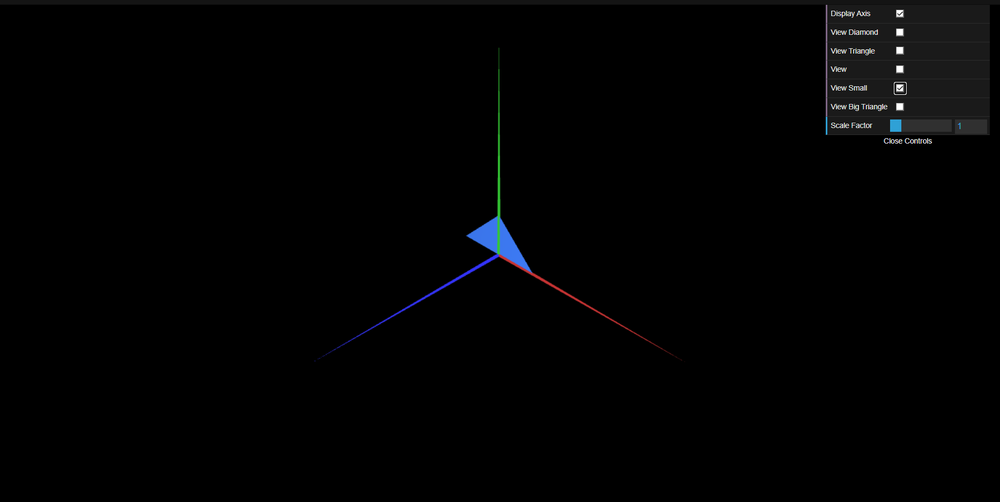
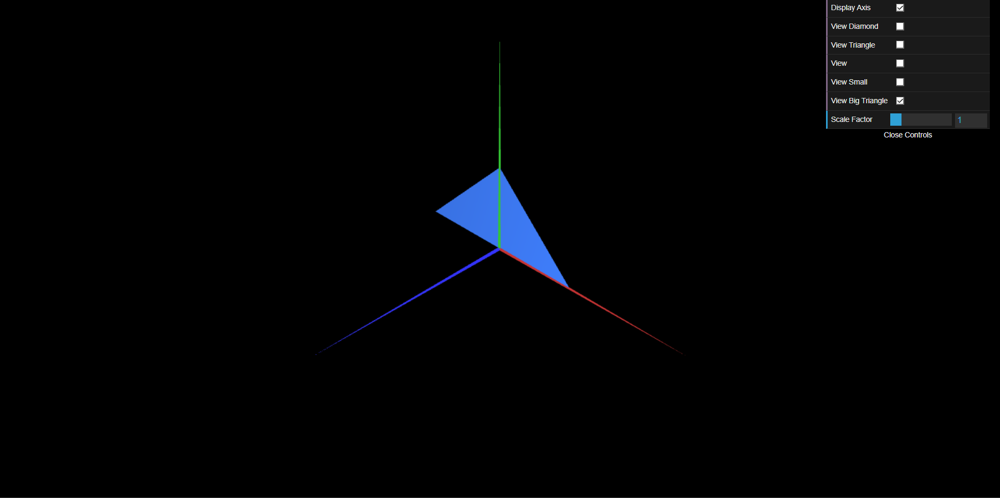

# CG 2023/2024

## Group T06G07

## TP 1 Notes

- In exercise 1, we observed how to break down different shapes into a minimal amount of simple shapes that constitute this same shape;
- Also in exercise 1, we observed how the order of indexes matter for how the shape is rendered from different angles and perspectives.
- In exercise 1, we initially had difficulties with understanding which orders are valid for the vertex indexes, and with utilizing the minimum amount of vertexes and connections between said vertexes.

- In exercise 2, we observed a Scaling of a triangle shape in between two different figures, keeping the same relative position and index order, but a different size.
- In exercise 2, there were no difficulties observed.
- Below are the two triangles drawn for this exercise, as requested.

